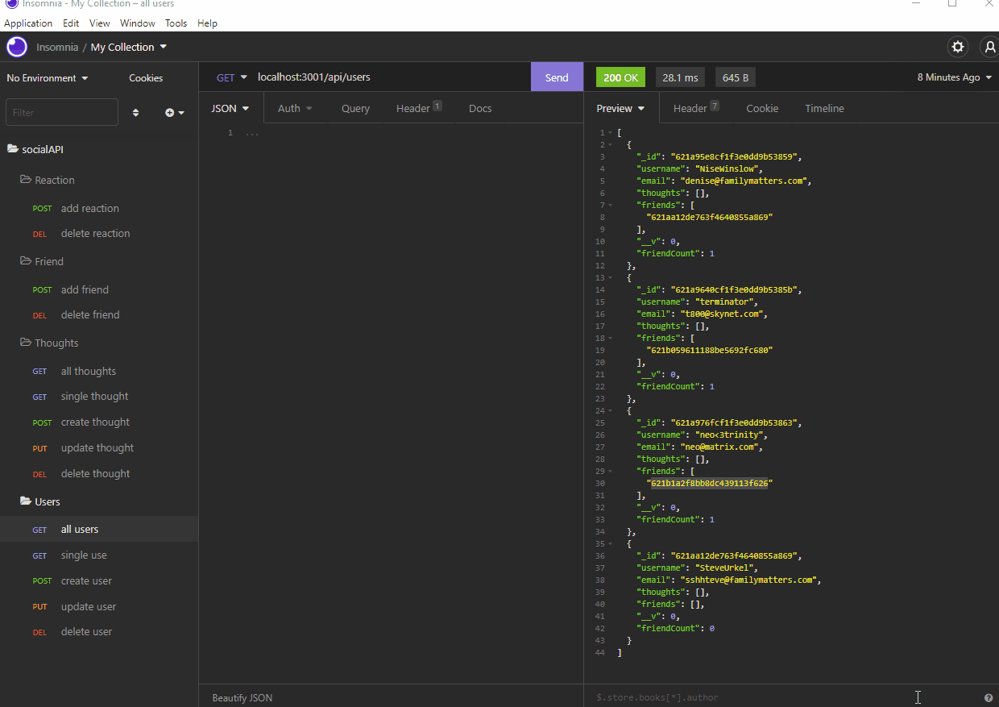

# socialAPI
## Description
This database is designed for a social network platform. This API includes endpoints for a user and theirs thoughts and for their friends to share reactions to those thoughts.

## Table of Contents

* [Installation](#Installation)
* [Usage](#Usage)
* [Tech](#Tech)
* [Links](#Links)
* [Demo](#Demo)
* [Contact](#Contact-me)

## Installation
Once cloning the repo, run npm i in the command line to install the necessary packages.
Then runt he server and proceed testing the routes.
## Usage
Use the command line to invoke necessary packages. Then start the server. Once the server is running, open the api route with Insomnia to the successfully use CRUD functionality.

## Tech 
Javascript, Express, noSQL, MongoDB, Mongoose
## Links
https://github.com/denisearevalo/socialAPI.git
## Demo
#### Part 1
 
### Contact me
Please feel free to email me with any questions or create a pull request and I will get back to you as soon as I am able.
deniwonder8@gmail.com

Kindly, Denise A